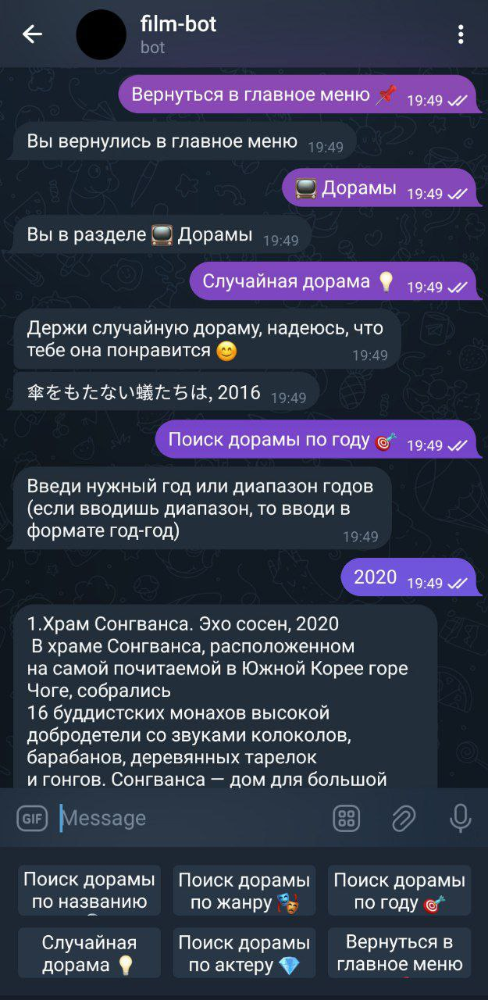

<h1 align="center">
Telegram бот DoranimeBot </h1>

Телеграм бот, позволяющий находить дорамы и аниме по различным критериям, а также сохранять произведения в список избранного.

# 
- Пустовалова Софья Алексеевна
- Завьялова Полина Игоревна
- Пеева Олеся Романовна
- Крамаренко Юрий Андреевич

# 
Реализован поиск аниме и дорам по критериям:
- по названию
- по жанру или нескольким жанрам
- по актеру
- по году или по диапазону годов
- находить случайное аниме или дораму

Также реализована возможность пользователем добавить аниме или дораму в список избранного. Список избранного можно редактировать и дополнять.
# 
Управление функционалом было реализовано при помощи кнопок.

Критерии поиска пользователь задает текстом. 

Примеры работы бота показаны на скриншотах.

 &nbsp; &nbsp;   

 &nbsp; &nbsp;   

 &nbsp; &nbsp;   

#  
- \start (начало работы: бот поприветствует вас и предложит ознакомиться с его функциями)  
- \help (вызов справки о функциях бота: бот выдаст список всех своих функций с описаниями)  
- ‘поиск по жанру’ (бот предложит ввести жанры, а затем выдаст подходящие дорамы или аниме)  
- ‘поиск по названию’ (бот предложит ввести название дорамы или аниме, а затем выдаст информацию о ней)  
- ‘поиск по актеру’ (бот предложит ввести имена актеров, а затем выдаст дорамы, в которых они играют)  
- ‘поиск по году’ (бот предложит ввести интересующий диапазон лет, а затем выдаст подходящие дорамы или аниме)  
- работа с “Избранным” (‘Избранное’/’Добавить в избранное’/’Удалить из избранного’ - пользователь вводит название, бот обрабатывает и работает с персональным списком пользователя)  
- случайная дорама или аниме (бот выведет информацию о случайной дораме или аниме из базы)
    
# 
Для поиска дорам и аниме использовалось api с сайта https://kinopoisk.dev/  

## 
Для того, чтобы собрать бота на своем устройстве:
1.  Скопируйте все файлы в свой проект
2.  Загрузите библиотеки mysql-connector, mysql-connector-python, telebot и pyTelegramBotAPI через pip install (или через Settings -> Python Interpreter, если у вас установлен PyCharm)

*Адрес бота в Telegram:* @DoranimeBot

